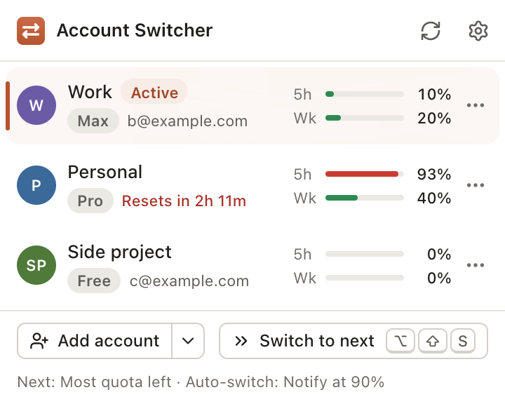
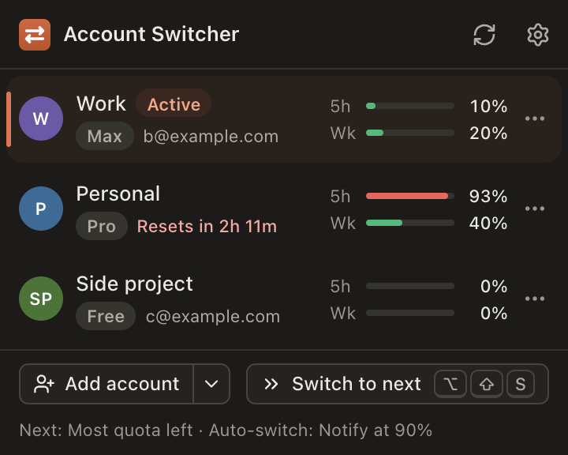
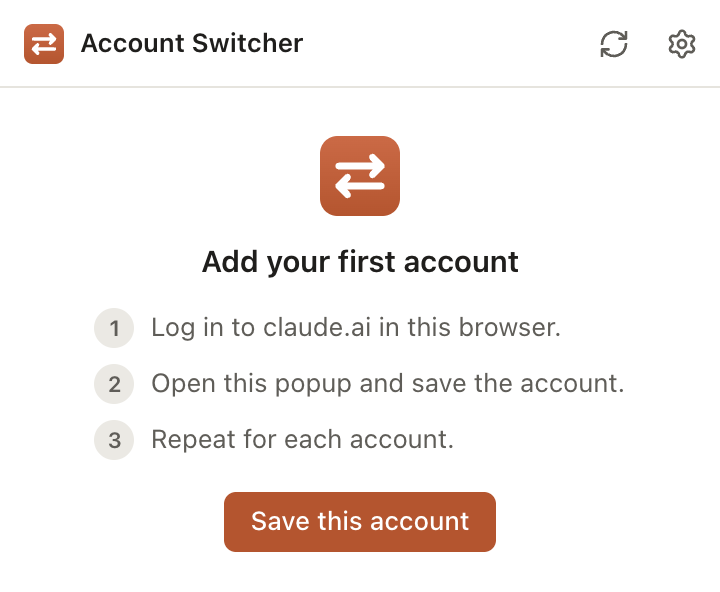
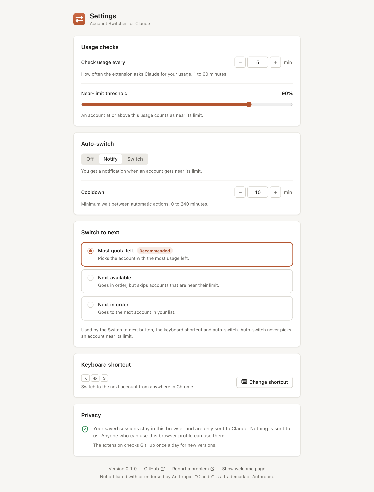
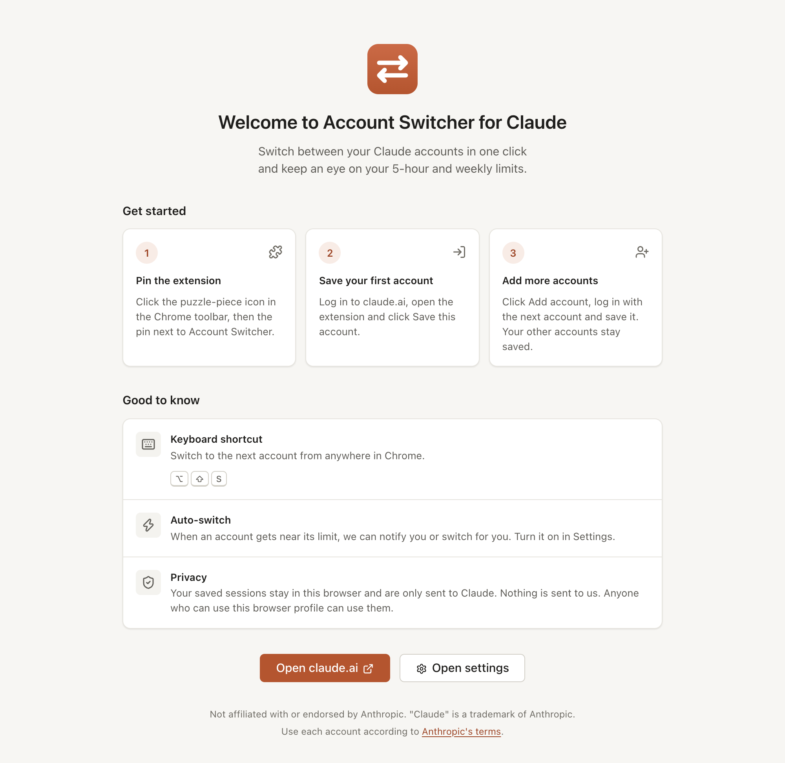

# Account Switcher for Claude

A Chrome extension to switch between several Claude accounts in one click, and to see each account's
**5-hour** and **weekly** usage.

> Not affiliated with or endorsed by Anthropic. "Claude" is a trademark of Anthropic.

<p align="center">
  
  &nbsp;
  
</p>

<p align="center">
  
</p>

## Features

- **Save accounts** and **switch** between them by clicking a row, without logging out.
  Open Claude tabs reload as the new account.
- **Toolbar badge** with the active account's usage, the higher of the 5-hour and weekly percent (for example `93%`). It turns amber, then red, near the limit.
- **Usage bars** for every account (5-hour and weekly), with reset times. Refreshed every few minutes.
- **Row menu** (the <kbd>⋯</kbd> button) to rename or remove an account, with an inline confirmation.
- **Switch to next** (button or <kbd>Alt</kbd>+<kbd>Shift</kbd>+<kbd>S</kbd>) with three strategies:
  most quota left, next available, or next in order.
- **Auto-switch**: notify you (or switch for you) when the active account gets near its limit.
- **Toasts** confirm each action. Errors show as a banner in plain words.
- **Keyboard**: <kbd>↑</kbd> <kbd>↓</kbd> move between accounts, <kbd>Enter</kbd> switches.
- **Welcome page** on first install, and an **unsaved-session banner** so you never lose a login.
- **Settings save automatically** as you change them.
- **Update notice** in the popup when a new version is released here.
- **Light and dark theme**, and all texts in `_locales/` so it is ready for translation.

## Install

The extension is not in the Chrome Web Store. Install it by hand:

1. Download **[account-switcher-for-claude.zip](https://github.com/itreza7/account-switcher-for-claude/releases/latest/download/account-switcher-for-claude.zip)**.
2. Unzip it into a folder you will keep (for example `~/Extensions/account-switcher-for-claude`).
   Chrome loads the extension from this folder, so do not delete it.
3. Open `chrome://extensions` and turn on **Developer mode** (top right).
4. Click **Load unpacked** and pick the folder.
5. Pin the extension from the puzzle icon in the toolbar.

## Update

When the popup says a new version is available:

1. Download the new zip and unzip it **into the same folder**, replacing the old files.
2. Open `chrome://extensions` and click the reload icon on the extension.

Your saved accounts stay. (Removing the extension deletes them.)

## Use

1. Log in to [claude.ai](https://claude.ai), open the extension and click **Save this account**.
2. Click **Add account** (with several sites, use the arrow next to it to pick the site). The extension keeps the first session,
   clears the login and opens the login page.
3. Log in with the second account, open the extension and click **Save** in the banner.
4. Click any account to switch to it, or use **Switch to next**.
5. Use the <kbd>⋯</kbd> button on a row to **Rename** or **Remove** it.

Settings (gear icon): usage check interval, near-limit threshold, auto-switch (off / notify / switch),
cooldown, and the "switch to next" strategy. Changes are saved as you make them.
Change the shortcut with **Change shortcut** or at `chrome://extensions/shortcuts`.

<p align="center">
  
  &nbsp;
  
</p>

**Remove** in the popup only makes the extension forget an account. It does not log you out.

## Privacy

- Your login cookies are saved **only on your computer**, in the extension's local storage.
  They are never synced or sent anywhere except to claude.ai itself.
- Anyone who can use your Chrome profile can use the saved sessions.
- The only other request is a daily check of this repository's latest release (no personal data).

## Before you use it

- Check that using several accounts this way is allowed by
  [Anthropic's terms](https://www.anthropic.com/legal/consumer-terms). You are responsible for how you use it.
- The extension uses claude.ai's internal web API, which can change at any time and break features.
- Console (platform.claude.com) support is experimental.

## Development

Needs Node.js 22.12 or newer.

```bash
npm install
npm run build      # build into dist/ (load it with "Load unpacked")
npm test           # unit tests
npm run e2e        # end-to-end test in a throwaway Chrome profile against a fake claude.ai (needs Chrome + openssl)
npm run zip        # build release/account-switcher-for-claude.zip
npm run screenshots  # e2e run that also refreshes the README images in docs/
```

### Release

1. Bump `version` in `package.json` and commit.
2. Tag and push: `git tag v0.2.0 && git push origin main v0.2.0`.
3. The **Release** GitHub Action tests, builds and publishes the zip.

## License

[MIT](LICENSE)
